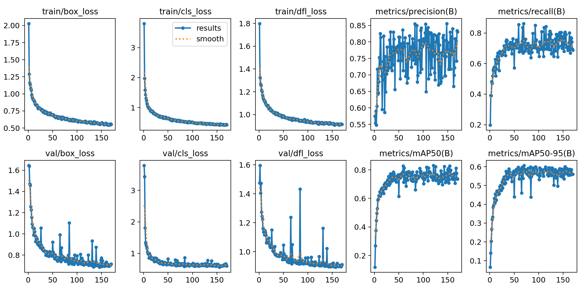
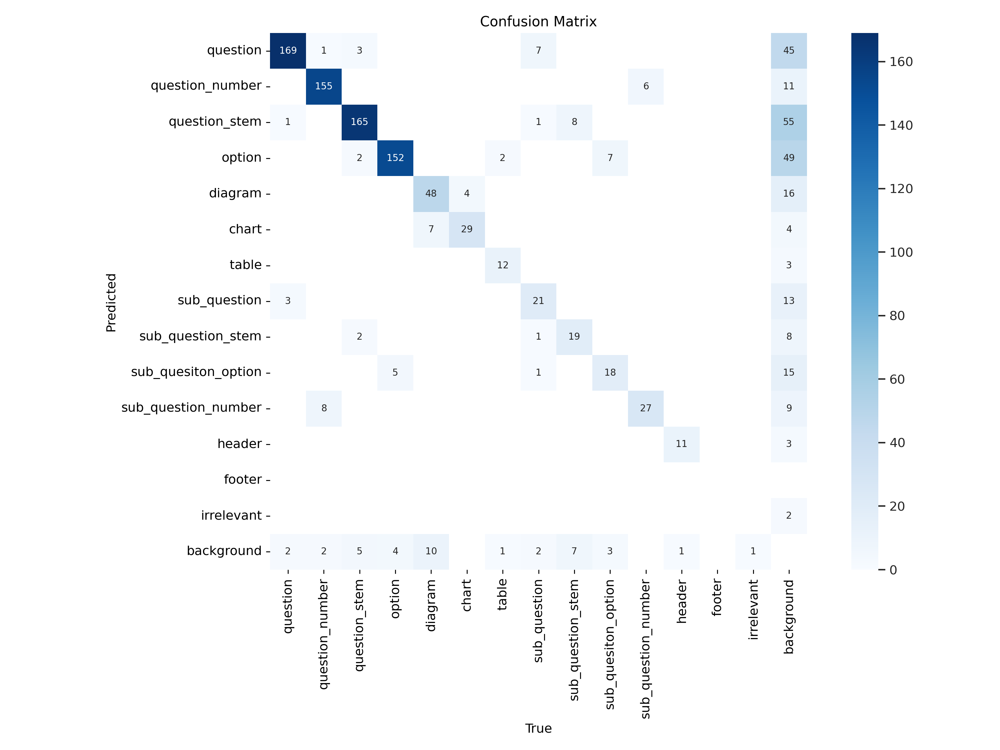
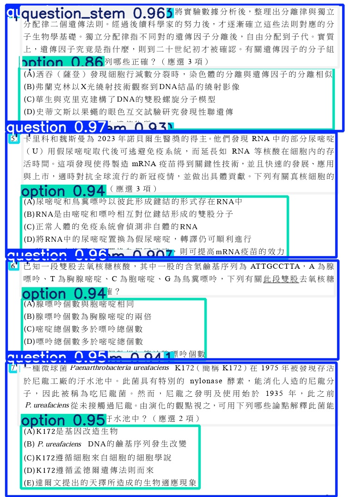
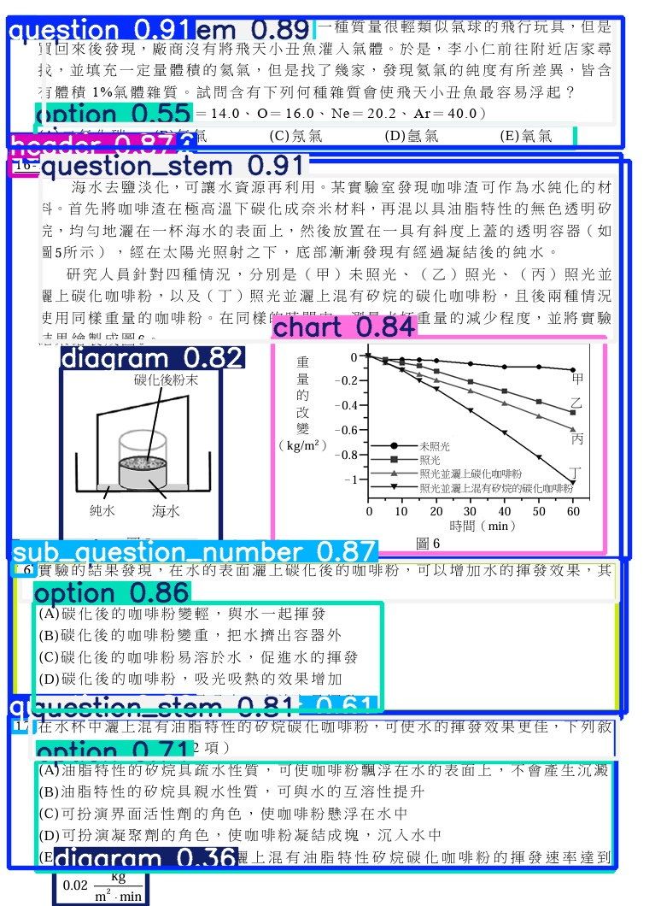

# 📂 outputs/

# 📂 outputs/

此資料夾用於儲存模型訓練與評估的輸出結果，例如：

- 微調後模型的 checkpoint
- 評估指標（如準確率、F1 分數）
- 模型產生的輸出內容
- 圖片預測結果或可視化圖表

由於檔案可能過大或會頻繁變動，實際內容不會被 Git 追蹤與上傳至 GitHub。

---

## 📌 特殊說明

- 本資料夾中的大部分檔案已被 `.gitignore` 忽略  
- 唯獨保留本 `README.md` 作為資料夾用途的說明  
- 若需示範輸出，可放置精簡範例（如小型截圖、摘要檔案）

---

## 🔄 目前輸出內容範例

- `evaluate_result/`：儲存模型評估指標（如準確率、F1、Loss 變化等）
- `lora-bio-checkpoint-final/`：最終微調後的模型權重（未上傳）
- `runs/`：YOLO 訓練過程產生的圖片與指標

---

## 📊 LLM評估結果

| Metric        | Value     |
|---------------|-----------|
| Accuracy      | 84.6%     |
| F1 Score      | 0.82      |
| Exact Match   | 75.3%     |
| BLEU (short)  | 0.68      |

※利用bert_score判斷生成文字與原始資料的差異，初步測試隨機50筆任務與資料

---

## 📝 LLM結果展示

**Question**:
> 請比較「基因突變」與「染色體變異」的定義與影響。

**Model Output**:
> 基因突變是指 DNA 序列的微小改變，通常影響單一基因；染色體變異則涉及整段染色體的結構或數量改變，對生物體影響較大。

---

## 🖼️ 範例輸出結果

### 📉 YOLO 訓練過程概況（包含 Loss 與 mAP）

### 📊 Confusion Matrix
驗證集上的分類準確表現如下圖所示：

### 📷 題目區塊偵測示意圖
以下為模型偵測一張考題圖片的結果，成功區分題幹、選項與圖表：

| 原始圖片偵測結果 | 另一個範例 |
|------------------|------------|
|  |  |

---

## 🚧 Work in Progress

- Improving answer coherence on multi-step reasoning
